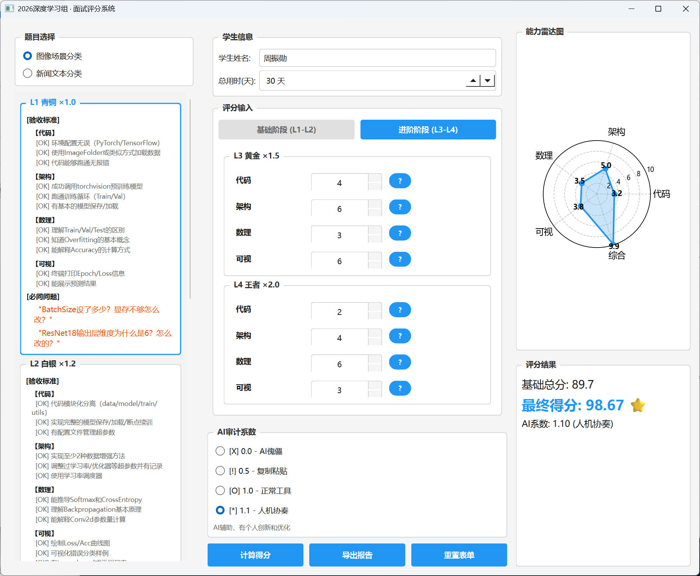

# 面试评分系统

> 小平工作室 · 深度学习组 | 2026 招新面试工具

<p align="center">
  
</p>

## 📐 评分计算模型

本系统采用 **「多维雷达加权评分系统 (MD-WSS)」**，核心逻辑：**分层累计积分 × AI置信度系数**

### 核心公式

$$
\text{Total Score} = \left( \sum_{i=1}^{4} (\text{Level}_i \text{ Score} \times W_i) \right) \times \gamma_{\text{AI}}
$$

**详细展开：**

$$
S_{\text{final}} = \left[ \sum_{i=1}^{4} \left( \sum_{d \in D} s_{i,d} \right) \times w_i \right] \times \gamma_{\text{AI}}
$$

其中：
- $s_{i,d}$ = 第 $i$ 层级第 $d$ 维度的得分
- $w_i$ = 第 $i$ 层级的难度权重
- $\gamma_{\text{AI}}$ = AI 审计系数

### 参数说明

| 参数 | 说明 | 取值范围 |
|------|------|----------|
| **层级得分** $\sum_{d} s_{i,d}$ | 该层级内四个维度得分总和 | $[0, 40]$ 分/层 |
| **层级权重** $w_i$ | 难度越高权重越大 | $w_1=1.0, w_2=1.2, w_3=1.5, w_4=2.0$ |
| **AI系数** $\gamma_{\text{AI}}$ | 审计学生对 AI 的使用程度 | $[0.0, 1.2]$ |

### AI 审计系数表

| 系数 | 判定等级 | 描述 |
|------|----------|------|
| **0.0 ~ 0.4** | 💀 AI 傀儡 | 代码全是 AI 生成，一问三不知 |
| **0.5 ~ 0.8** | ⚠️ 复制粘贴 | 能跑通但解释不清，Debug 全靠运气 |
| **0.9 ~ 1.0** | 😐 正常工具 | 合理使用 AI，能解释代码逻辑 |
| **1.1 ~ 1.2** | 🌟 人机协奏 | 驾驭 AI，Prompt 技巧高超，能改进 AI 方案 |

### 计算示例

学生完成 L1(满分) + L2(部分) + L3(可视化)：

| 层级 | 计算 | 加权得分 |
|------|------|----------|
| L1 | $(10+10+10+10) \times 1.0$ | $40$ |
| L2 | $(8+8+6+10) \times 1.2$ | $38.4$ |
| L3 | $(0+0+0+8) \times 1.5$ | $12$ |
| L4 | $0$ | $0$ |
| **基础总分** | $\sum$ | $90.4$ |
| **AI 系数** | $\gamma_{\text{AI}} = 1.05$ | - |
| **最终得分** | $90.4 \times 1.05$ | $\mathbf{94.92}$ |

---

## 🎯 功能特点

- **双题目支持**：图像场景分类 / 新闻文本分类
- **四级难度体系**：青铜(L1) → 白银(L2) → 黄金(L3) → 王者(L4)
- **四维度评分**：代码能力、架构设计、数理基础、可视化展示
- **可视化分析**：能力雷达图直观展示候选人各方面水平
- **报告导出**：一键生成面试评分报告

---

## 🚀 快速开始

### 环境要求

- Python 3.10+
- Windows 10/11

### 安装运行

```bash
pip install -r requirements.txt
python main.py
```

### 打包为可执行文件

```bash
python -m PyInstaller --name="面试评分系统" --windowed --onefile main.py
```

打包后的 `面试评分系统.exe` 位于 `dist/` 目录。

---

## 📊 使用说明

1. **选择题目**：左栏切换图像分类或文本分类
2. **填写信息**：输入学生姓名和完成天数
3. **评分输入**：在基础阶段(L1-L2)和进阶阶段(L3-L4)分别打分
4. **AI 审计**：根据学生对 AI 代码的理解程度调节系数
5. **查看结果**：右栏显示分数和能力雷达图
6. **导出报告**：保存完整评分结果

---

## 🛠️ 技术栈

- **GUI 框架**：PyQt6
- **可视化**：Matplotlib
- **语言**：Python 3

---

<p align="center">
  <sub>© 2026 小平工作室 · 深度学习组</sub>
</p>
